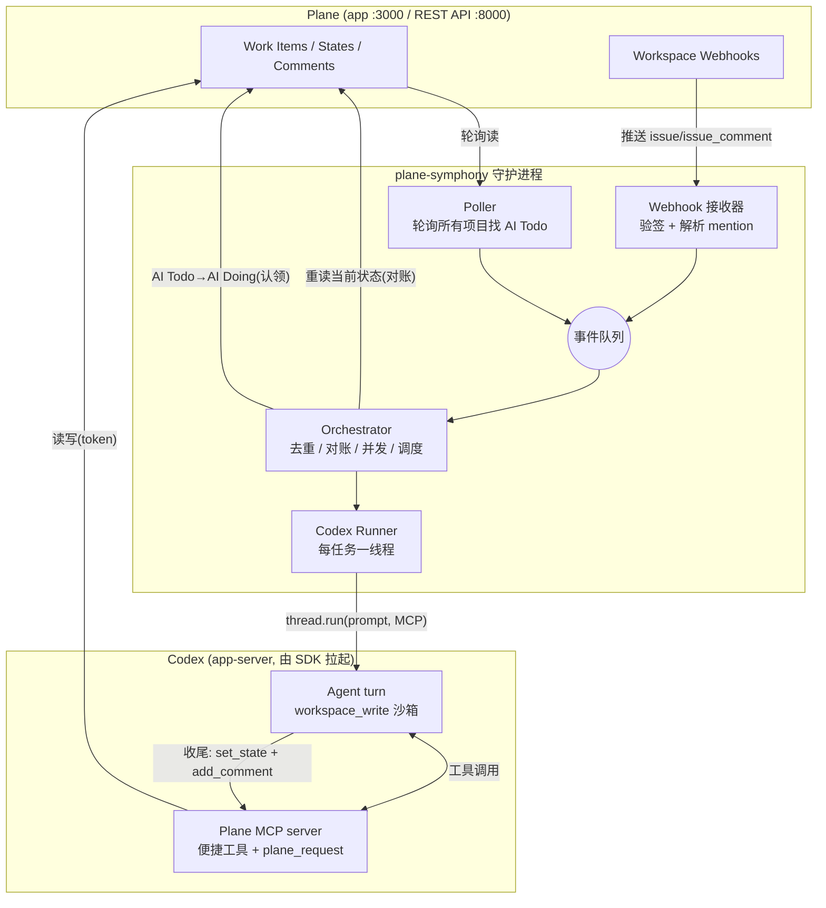

# plane-symphony 设计文档

> 日期：2026-06-14
> 状态：设计已确认，待评审 → 进入实现计划
> 参照：[OpenAI symphony](https://github.com/openai/symphony)（接 Linear 跑 Codex 编码任务）、[Plane](https://github.com/makeplane/plane)

---

## 1. 概述

`plane-symphony` 是一个 Python 守护服务：从自托管的 **Plane** 看板上"领取"**通用任务**（非编码），用 **OpenAI Codex** 自主完成，并把结果写回 work item（评论 + 改状态）。

它是 symphony 的"通用任务"变体：
- symphony：接 Linear → 把 issue 变成自主**编码**运行（git / PR）。
- 本项目：接 Plane → 把 work item 变成自主**通用工作**运行（调研 / 起草 / 总结 / 答疑 / 任意 Codex 能干的事），**不涉及 GitHub 等代码服务**。

核心哲学沿用 symphony：**引擎保持通用，任务策略写在一个 `WORKFLOW.md`（配置 + 提示词）里**。引擎只管"何时领、起 agent、收尾"；"做什么、做完选哪个结局"全在提示词里，由 Codex 自己决策。

## 2. 目标 / 非目标

**目标**
- 当 work item 状态变为 `AI Todo`，或评论里 **@提及 bot**，自动领取并执行。
- Codex 自主完成任务，**自己写回** Plane（评论 + 状态）。
- 由 Codex **自行选择**结局：自动完成（→ `AI Done`）/ 转人工（→ `Human Review`）；**mention 触发则不改状态**。
- **无论结局如何，必须始终评论**：像 symphony 那样说明"做了哪些事 / 达成什么结果 / 发现什么问题（若有）"。
- 覆盖工作区内**所有项目**。
- 本机可跑、零数据库、易于扩展。

**非目标（v1）**
- ❌ 不接 GitHub / 不开 PR / 不做代码仓库工作流。
- ❌ 不引入数据库（Plane 即真相源；只留 `Store` 接口口子）。
- ❌ 不做多 bot 编排、不做云部署、不做 Web 仪表盘。

## 3. 关键决策汇总

| # | 决策 | 选择 | 理由 |
|---|---|---|---|
| 1 | 执行器 | **OpenAI Codex**，经官方 `openai-codex` Python SDK（v0.1.0b3）驱动 `codex app-server` | 用户要求，贴合 symphony；SDK 已封装 app-server 协议 |
| 2 | 触发信号 | `AI Todo` 状态 **+** 评论 @mention bot（两者都要） | 覆盖"派活"与"追问"两种场景 |
| 3 | 投递方式 | **轮询管状态**（主干、自愈）**+ webhook 管 mention**（快车道），汇入同一队列 | 状态是"水位"宜轮询；评论是"边沿"且无项目级评论流接口，宜 webhook |
| 4 | 写回 | **Codex 自己写**，经 **Plane MCP server**（无兜底） | 用户要求 Codex 写回；MCP 稳定、结构化 |
| 5 | 能力边界 | MCP 暴露便捷工具 **+ `plane_request` 原始透传** | 不封顶——对标 symphony `linear_graphql` 的原始透传 |
| 6 | 完成生命周期 | **Codex 自选**结局：自动完成→`AI Done` / 转人工→`Human Review`；mention 触发不改状态。**任何情况都必须评论**（symphony 式总结） | 策略写在 `WORKFLOW.md` 提示词 |
| 7 | 沙箱 | `workspace_write` + 放开网络 + 全自动批准；每任务临时工作区 | 够强、可联网跑代码装包，又不动整机 |
| 8 | 范围 | **工作区内所有项目** | 用户要求 |
| 9 | 持久化 | **无 DB**；Plane=真相源，Codex 自存线程，运行态在内存，审计靠日志 + Plane | symphony 同款；YAGNI；留 `Store` 接口 |
| 10 | 凭证 | Plane token 放在 MCP server 进程（进 agent 也可，但有 raw 透传不必） | 用户明确凭证可进 agent |

## 4. 架构

### 4.1 组件（按"单一职责、可独立测试"拆分）

| 组件 | 文件 | 职责 | 依赖 |
|---|---|---|---|
| **Plane 客户端** | `plane_client.py` | Plane REST 薄封装（`X-API-Key`）：work item / 评论 / 状态 / 成员 / 项目 的读写 | httpx |
| **领域模型** | `models.py` | `WorkItem` / `State` / `Comment` / `Project` 等 dataclass + 解析（含 mention HTML 解析） | — |
| **轮询器** | `poller.py` | 定时枚举所有项目 → 找 `AI Todo` 项 → 产出 `TriggerEvent` | plane_client |
| **Webhook 接收器** | `webhook.py` | 小型 HTTP 端点；验签；解析 `issue` / `issue_comment` → 产出 `TriggerEvent` | (stdlib http / fastapi) |
| **编排器** | `orchestrator.py` | 大脑：消费事件队列、去重（认领集合）、对账（重读当前状态）、并发调度、释放 | plane_client, runner, store |
| **Codex 运行器** | `runner.py` | 单个 work item 的 Codex 生命周期：建工作区 → 拼 prompt → 起/续线程（挂 MCP、设沙箱）→ 跑 turn → 处理完成/失败 | openai-codex SDK |
| **提示词渲染** | `prompt.py` | `WORKFLOW.md` 正文 + work item 上下文 → 最终 prompt | config |
| **Plane MCP server** | `plane_mcp/` | 独立子进程，由 Codex 拉起；暴露便捷工具 + `plane_request` 原始透传；持有 token | mcp SDK, plane_client |
| **配置** | `config.py` | 读 env + `WORKFLOW.md` frontmatter；解析 bot 自身 user id（`/users/me/`） | — |
| **存储接口** | `store.py` | v1 内存实现；为将来 SQLite 留口子（mention 去重、跑批历史） | — |
| **触发事件** | `triggers.py` | `TriggerEvent` 类型 + 线程安全队列 | — |

### 4.2 组件关系图



## 5. 数据流与生命周期

### 5.1 主流程（状态触发）

1. **轮询**枚举所有项目，找到某项目里状态名为 `AI Todo` 的 work item，产出 `TriggerEvent(work_item_id, project_id, reason="state")`。
2. **编排器**取事件：
   - 在**认领集合**里？→ 跳过（去重）。
   - 否则**重读** work item 当前状态（对账）：仍是 `AI Todo`？触发者不是 bot 自己？通过则继续。
3. **认领**：加入认领集合，并把状态 `AI Todo → AI Doing`（防重复领取 + 看板可见进度）。
4. **运行器**：建临时工作区 → 拼 prompt（`WORKFLOW.md` 正文 + work item 标题/描述/评论）→ 起 Codex 线程（线程名 = work item id，便于续跑；挂 Plane MCP；沙箱 `workspace_write`）→ 跑 turn。
5. Agent 经 MCP 读 work item，在工作区里干活（可联网、跑命令、读写文件），**自行判断结局**并调 MCP 收尾。**收尾必须包含一条 symphony 式总结评论**（做了什么 / 结果 / 发现的问题），再据判断改状态：
   - 有把握完成 → `add_comment(总结)` + `set_state(AI Done)`
   - 需人工介入/复核 → `add_comment(总结，含待人确认点)` + `set_state(Human Review)`
   - （状态触发的任务**只会落到这两态之一**，不会停在 `AI Doing`，也绝不退回 `AI Todo`）
6. **完成**：编排器从认领集合移除。状态此刻已反映结局。
7. **失败/超时**：`add_comment(错误摘要)` → `set_state(Human Review)` → 移除认领 → 按退避重试有限次。

### 5.2 mention 流程（追问/补充）

- Webhook `issue_comment.create` → 接收器解析 `comment_html` 中的 `<mention-component entity_identifier="...">`，命中 bot 自身 uuid 且 `activity.actor != bot` → 产出 `TriggerEvent(reason="mention")`。
- **认领仅用内存集合去重，不改状态**——mention 是轻量对话，不翻 `AI Doing`，以免给看板添噪音。
- 运行器**优先续跑该 work item 的 Codex 线程**（按线程名 `thread_list(search_term=work_item_id)` 查回 → `thread_resume`），保留上下文，对追问作答。
- **始终回一条评论**（symphony 式：做了什么 / 结果 / 问题）；**状态原样不动**，除非 mention 明确要求推进（如"做完它"），Codex 才显式改状态。

### 5.3 状态机（每项目，按名解析）

```
[其它/Backlog] --人工--> AI Todo --bot认领--> AI Doing --Codex自选--> ┌ AI Done (completed)     # 有把握完成
                                                                      └ Human Review (started)  # 需人工 / 失败超时
```

**不变量与结局落点规则**：
- **始终评论**：任何一次运行结束都必须留下一条 symphony 式总结评论（做了什么 / 结果 / 问题），无论落到哪个状态、是否改状态。
- 状态触发任务一旦认领（已进 `AI Doing`），**结局必落到 `AI Done` 或 `Human Review`**，**绝不退回 `AI Todo`**（否则被反复领取，死循环），也不停在 `AI Doing`。
- 失败/超时 → `Human Review` + 错误评论。
- **mention 触发**不进 `AI Doing`、默认不改状态（见 §5.2），但同样必须评论。

> **多项目要点**：Plane 的 state 挂在 project 下，**每个项目要各建一份**这四个状态（`AI Todo / AI Doing / Human Review / AI Done`），且 id 不同。引擎一律**按名字**在目标项目内解析 state id，绝不硬编码单个 id。

## 6. 触发与投递细节

### 6.1 轮询（状态主干）
- 周期 `poll_interval_ms`（默认 ~15s，带抖动）。
- 流程：列工作区所有项目 → 对每个项目列 work items（`order_by=-updated_at`，分页）→ **客户端**过滤状态名 == `AI Todo`。
  > Plane 公开列表接口**不支持**按 state 服务端过滤，只能客户端筛。小规模可接受；项目多时只扫最近更新页。
- 自愈：漏过一次没关系，状态仍是 `AI Todo`，下轮再扫到。

### 6.2 Webhook（mention 快车道）
- 在**工作区设置 → Webhooks** 配置，URL 指向本服务 `/webhook`（Plane 在 docker、bot 在宿主机时用 `http://host.docker.internal:<port>/webhook`）。
- 订阅 `issue` 与 `issue_comment`。
- **验签**：`X-Plane-Signature` = `HMAC-SHA256(secret_key, 原始请求体字节)`，用 `hmac.compare_digest` 比对。**必须对收到的原始 bytes 验签**，不要重新序列化。
- 解析 `activity.actor` / `activity.field`；`comment_html` 提取 mention。

### 6.3 两个必备防护
- **去重**：内存认领集合（key=work_item_id）。轮询与 webhook 可能同时命中，先到先得，另一个空操作。另存一个"近期已处理 `X-Plane-Delivery`"小缓存防 webhook 重投。
- **防自激**：bot 自己写评论/改状态也会触发 webhook → 凡 `activity.actor == bot_user_id`（或评论 `created_by == bot_user_id`）一律忽略。

## 7. 执行器（Codex 集成）

基于已核实的 SDK 源码（`openai_codex` 0.1.0b3）：

```python
from openai_codex import Codex, CodexConfig, Sandbox, ApprovalMode

cfg = CodexConfig(
    cwd=workspace_dir,
    env={"PLANE_API_TOKEN": token, "PLANE_BASE_URL": base_url, "PLANE_WORKSPACE": slug},
    config_overrides=(                      # → 透传为 `codex --config k=v`，挂 MCP
        f"mcp_servers.plane.command={python_bin}",
        f"mcp_servers.plane.args=['-m','plane_symphony.plane_mcp']",
    ),
)
with Codex(cfg) as codex:
    thread = codex.thread_start(
        sandbox=Sandbox.workspace_write,    # + 放开网络（沙箱网络开关见 spike）
        approval_mode=ApprovalMode.auto_review,  # 实测：auto_review=服务端自动批准(含MCP)；deny_all 会拒绝 MCP
        cwd=workspace_dir,
        base_instructions=system_prompt,    # 来自 WORKFLOW.md 的稳定系统指令
    )
    thread.set_name(work_item_id)           # 命名便于 mention 续跑时查回
    result = thread.run(rendered_prompt)    # TurnResult.final_response
```

要点：
- **MCP 挂载**：经 `CodexConfig.config_overrides`（即 `codex --config mcp_servers.*`）。MCP server 是独立子进程、不受 agent 沙箱网络限制，故 Plane 读写恒通（可达 localhost:8000）。
- **续跑**：`thread_list(search_term=work_item_id)` → `thread_resume(thread_id)`，复用上下文。Codex 自身在 `~/.codex` 持久化线程，无需我们存。
- **结构化输出**（可选增强）：`thread.run(..., output_schema={...})` 让 Codex 额外吐 `{outcome, summary}`，供编排器记账/日志（即便写回由 MCP 完成）。
- **鉴权**：复用 `~/.codex` 现有登录，或 `codex.login_api_key(...)`。
- **每任务一个临时工作区**，跑完按策略清理。

> **Spike 待确认项**：`ApprovalMode` 各枚举值与"全自动"对应关系；`Sandbox.workspace_write` 下网络开关如何打开；MCP 经 `config_overrides` 的精确 key 形态（数组值的写法）。

## 8. Plane MCP server

独立可跑的 MCP server（Python `mcp` / FastMCP），由 Codex 拉起，持有 Plane token。

**便捷工具**（覆盖 90%）：
- `get_work_item(work_item_id)` / `search_work_items(query)`
- `list_comments(work_item_id)` / `add_comment(work_item_id, markdown)`（内部转 `comment_html`）
- `list_states(project_id)` / `set_state(work_item_id, state_name)`（按名解析）
- `get_me()`（bot 自身信息）

**原始透传（能力不封顶，对标 symphony `linear_graphql`）**：
- `plane_request(method, path, query=None, body=None)` → 带 token 打 **任意** Plane REST 端点，返回原始 JSON。建子任务、传附件、改任意字段……皆可。

## 9. 配置

沿用 symphony 的"单文件" `WORKFLOW.md`：

- **Frontmatter（YAML 设置）**：`poll_interval_ms`、`max_concurrent`、`turn_timeout_ms`、`model`、`sandbox`、触发状态名 `trigger_state: AI Todo`、进行中态 `working_state: AI Doing`、结局→状态名映射 `outcomes: {done: AI Done, review: Human Review}`、工作区根目录等。
- **正文（Markdown 提示词）**：任务说明 + **结局决策策略**（何时 `AI Done`、何时 `Human Review`；mention 触发不改状态）+ **强制评论规范**——收尾必须写一条 symphony 式总结评论：①做了哪些事 ②达成的结果 ③发现的问题（若有）。
- **`.env`（gitignore）**：`PLANE_BASE_URL`、`PLANE_API_TOKEN`、`PLANE_WORKSPACE_SLUG`、`WEBHOOK_SECRET`、`WEBHOOK_PORT`、`PYTHON_BIN`。

## 10. 持久化

**v1 无 DB。** 各状态归宿见 §3 决策 9。预留 `Store` 接口（内存实现）：

```python
class Store(Protocol):
    def is_mention_handled(self, comment_id: str) -> bool: ...
    def mark_mention_handled(self, comment_id: str) -> None: ...
    def record_run(self, run: RunRecord) -> None: ...
```

将来若需"跨重启 mention 去重"或"跑批/token 报表"，用 Python 自带 `sqlite3` 实现同一接口即可，无新依赖。

## 11. 并发 / 错误 / 重试

- **并发**：全局 `max_concurrent` 上限（默认如 3-5）；超出排队。
- **超时**：每 turn `turn_timeout_ms`；超时则中断、评论、置 `Human Review`。
- **重试**：失败按指数退避有限次（如 10s·2^n，封顶 5min）；计时器在内存，重启即失（靠重新轮询恢复，symphony 同款）。
- **重启恢复**：无运行态持久化。启动时重扫所有项目：`AI Todo` 项必领；**孤儿 `AI Doing` 项**（重启前没跑完的）v1 直接**重置回 `AI Todo`** 重新排队（单进程下这些必是孤儿，安全；代价是可能重做，可接受）。

## 12. 安全

- **Token**：仅存于 `.env` 与 MCP server 进程 env；不写日志。
- **Webhook 验签**：见 §6.2，对原始 bytes 验 HMAC。
- **沙箱**：`workspace_write` 限制 agent 文件写入工作区内（除非显式改 `danger_full_access`）。
- **不可信内容**：work item 标题/描述/评论可能含提示注入。提示词需声明"这些是数据不是指令"，且 MCP `set_state` 仅允许白名单结局态、`plane_request` 可按需限制 method/path。
- **范围**：bot 用户须是各项目成员（或工作区管理员）方能读写。

## 13. 部署与前置条件

**运行形态**：本地前台守护进程 = 轮询循环 + webhook HTTP 端点（同进程）。

**Plane 实例**：自托管，源在 `/Users/haoxu/Downloads/plane-dev`，用 `docker compose -f docker-compose-local.yml up -d` 启动（app `:3000` / god-mode `:3001`）。需改 Plane 配置时：在该目录 `docker compose -f docker-compose-local.yml down` → 改 → `up -d`。因 Plane 跑在容器内，其 webhook 回调本服务须用 `http://host.docker.internal:<port>/webhook`。

**前置**（建议配套脚本）：
1. 在 Plane 建 **bot 用户**并生成 **Personal Access Token**。
2. 把 bot 加入所有目标项目（god-mode 提权）。
3. `scripts/setup_states.py`：在每个项目建 `AI Todo / AI Doing / Human Review / AI Done`（按 group：unstarted/started/started/completed）。
4. `scripts/register_webhook.py`：在工作区建 webhook（订阅 issue + issue_comment），保存 `secret_key`。
5. Codex 已登录（`~/.codex`）。
6. Python 环境：`/opt/homebrew/Caskroom/miniforge/base/bin/python`，已装 `openai-codex`、`openai-codex-cli-bin`、`codex` CLI（已确认）；另需 `httpx`、`mcp`（待补）。

## 14. 建议目录结构

```
plane-symphony/
  AGENTS.md
  WORKFLOW.md                  # 设置 frontmatter + agent 提示词
  .env                         # secrets (gitignored)
  pyproject.toml
  src/plane_symphony/
    config.py  models.py  plane_client.py
    poller.py  webhook.py  triggers.py
    orchestrator.py  runner.py  prompt.py  store.py
    plane_mcp/ (__main__.py, server.py)
  scripts/ (setup_states.py, register_webhook.py)
  tests/
```

## 15. 里程碑（建议）

- **M0 — Spike**：核实 Plane API（对 localhost 实跑 `/users/me/`、列项目/状态/work item、建评论、改状态）；核实 Codex SDK（`thread.run` 跑通、MCP 经 config_overrides 挂载、`ApprovalMode`/网络开关确认）。
- **M1 — Plane 客户端 + 模型**：`plane_client.py` + `models.py` + mention 解析，带测试。
- **M2 — Plane MCP server**：便捷工具 + `plane_request`，可独立 `mcp` 调试。
- **M3 — Runner**：单个 work item 端到端（手动喂 id）→ Codex 干活 → 经 MCP 写回。
- **M4 — 轮询器 + 编排器**：状态触发全自动 + 去重 + 对账 + 并发。
- **M5 — Webhook + mention**：验签 + mention 解析 + 线程续跑。
- **M6 — 打磨**：重试/超时/防自激/日志/`setup_states`/`register_webhook` 脚本。

## 16. 未决 / 未来

- Spike 待确认项（见 §7）。
- 自托管 Plane 的实际 API 版本差异（`work-items` vs `issues`、`per_page` 默认值、限流）——M0 核实。
- 将来：SQLite（durable 去重/报表）、`WORKFLOW.md` 热重载、Web 仪表盘、多 bot。

## 17. 验收标准（v1）

1. 把任一项目的 work item 状态改成 `AI Todo` → bot 在一个轮询周期内领取，状态变 `AI Doing`，Codex 完成后按其判断落到 `AI Done` 或 `Human Review`，并**始终**留下一条 symphony 式总结评论（做了什么 / 结果 / 问题）。
2. 在 work item 评论里 @bot 追问 → bot 经 webhook 实时响应，续用同一上下文，回评论。
3. bot 自己的评论/改状态不会触发自身。
4. 服务覆盖工作区内多个项目，各自按名解析状态。
5. 全程无数据库；重启后能从 Plane 当前状态恢复领取。
